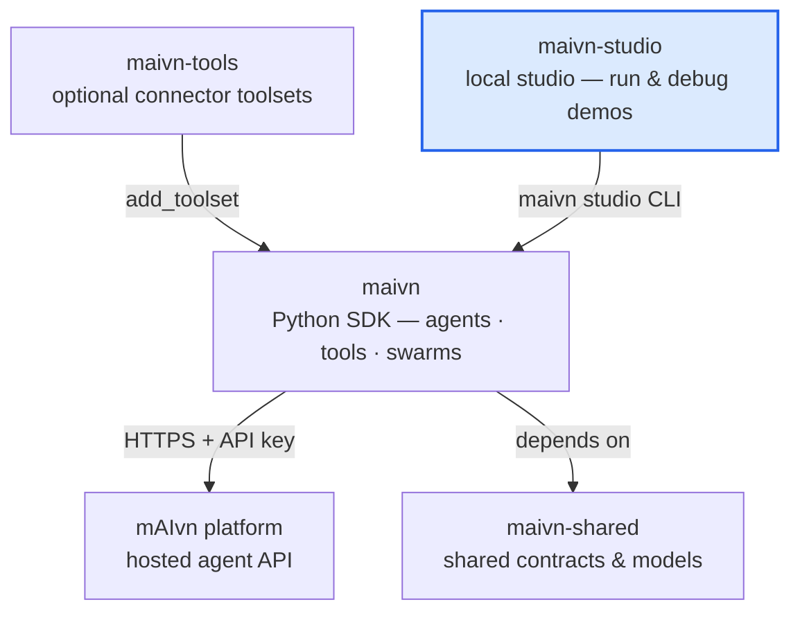

# mAIvn Studio

Local developer studio for discovering demos, running sessions, and debugging agent workflows.

## Key Capabilities

- Demo discovery from configured repository paths
- Rich demo introspection (agents, swarms, tools, prompts, private data schema)
- Multi-turn session APIs
- Batch Matrix and async-batch session execution with grouped result cards
- Real-time Server-Sent Events stream for execution visibility
- Runtime patching for demos, agents, and swarms

## Ecosystem

`maivn-studio` is the local studio in the **mAIvn** developer ecosystem. Learn more at
[maivn.io](https://maivn.io) — or dive into the developer hub at
[developer.maivn.io](https://developer.maivn.io).



## Quick Start

For end users or SDK consumers:

```bash
pip install "maivn[studio]"
maivn studio
```

Run `maivn studio` from the directory that contains your `maivn_studio.json`
file. Studio discovers that config from the current working directory and then
walks up parent directories.

You can also launch the companion package directly:

```bash
maivn-studio
```

For monorepo development:

```bash
uv sync
cd apps/maivn-demos
uv run maivn studio
```

If you need to run the Studio package directly:

```bash
cd apps/maivn-studio
uv run -m maivn_studio
```

If you launch Studio without a config file, the default URL is
`http://127.0.0.1:8080`. The shared demos config at
`apps/maivn-demos/maivn_studio.json` uses `http://127.0.0.1:8088`.

## Documentation

- `docs/getting-started.md`
- `docs/authoring-and-debugging.md`
- `../../libraries/maivn/docs/guides/maivn-studio.md`
- `../../libraries/maivn/docs/api/events.md`
- `../../libraries/maivn/docs/guides/frontend-events.md`

Studio's backend event stream is built on the shared `maivn.events.EventBridge` contract. Known mAIvn event families are standardized in the shared bridge layer, so Studio inherits canonical packet shapes and stable tool/assignment/scope identities from the SDK. Replay ownership is explicit in the session execution path, Studio keeps any legacy/raw frontend compatibility parsing at the SSE ingress boundary, and the remaining app-specific dedupe is limited to overlapping logical deliveries such as repeated interrupts or repeated identical status messages within a turn.

## Configuration

Studio reads `maivn_studio.json` (if present) for:

- host/port
- demo discovery paths
- explicit demo definitions and variants

## Developer Commands

```bash
# From apps/maivn-studio

# Backend tests
uv run pytest tests/

# Backend checks
uv run pyright
uv run ruff check .
uv build --wheel
python scripts/check_wheel_contents.py dist/*.whl

# Frontend tests and checks
cd frontend
npm ci
npm run test
npm run check
npm run lint
npm run build
npm run format:check
```
